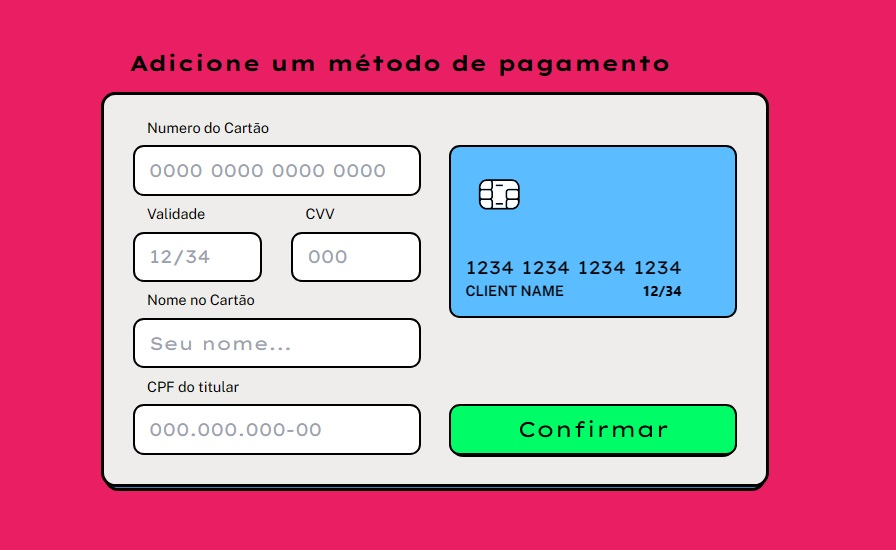

# Card Payment

This project aims to simulate a screen for adding credit/debit cards to the payment method of an online sales website. The main focus of this project lies in the interactive visualization of the card, coupled with integration with the form, where data is updated in real time. Additionally, an animation is executed to reveal the back of the card, displaying the CVV code.

<p align="center">
  
</p>


## Technologies Used

This project was created using the following technologies:

- [Tailwind CSS](https://tailwindcss.com/) for styling.
- [Next.js](https://nextjs.org/) for building React applications with server-side rendering.
- [react-text-mask](https://www.npmjs.com/package/react-text-mask) for mask number like card number, CPF...

## How It Works

The real-time update of card data utilizes setState in conjunction with react-text-mask for masked fields and simple text input for fields that do not require masking.

The card rotation animation utilizes 'transform' with 'perspective' and 'rotateY'. The classes were created within the '@layer' of Tailwind CSS, as they are not officially supported.

```css
  .rotate-y-360-pers-800 {
    transform: perspective(800px) rotateY(360deg);
  }
```

---
Feel free to fork and use as you want.